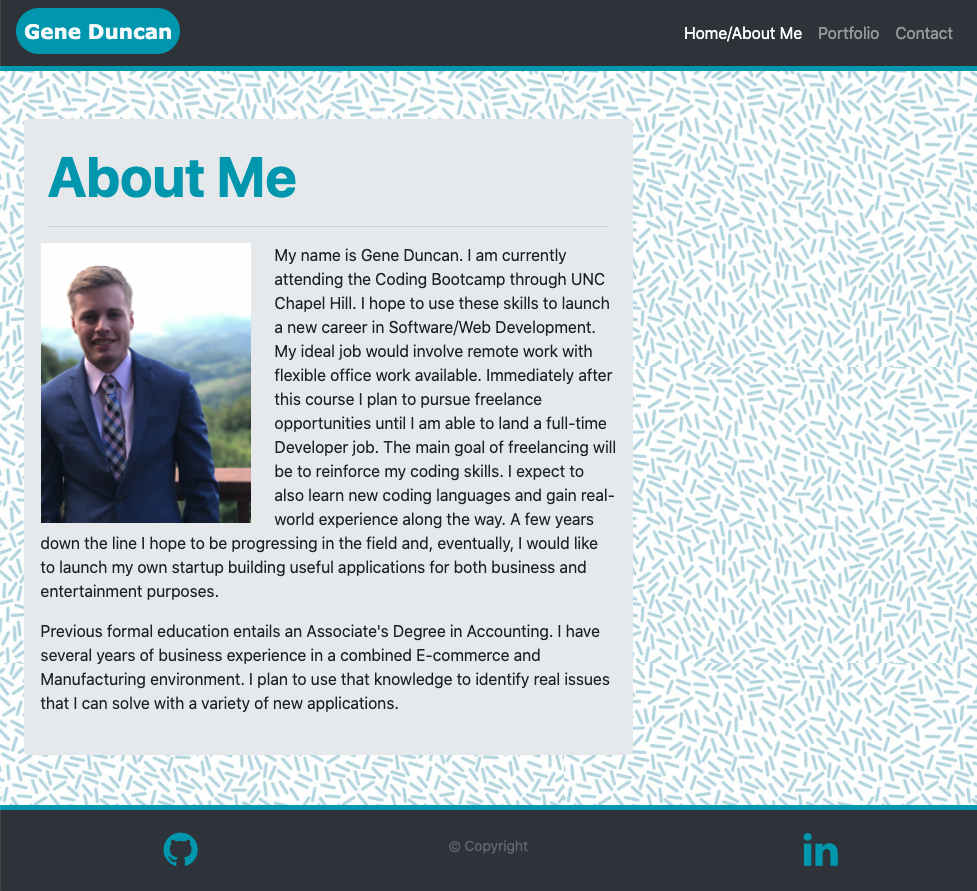
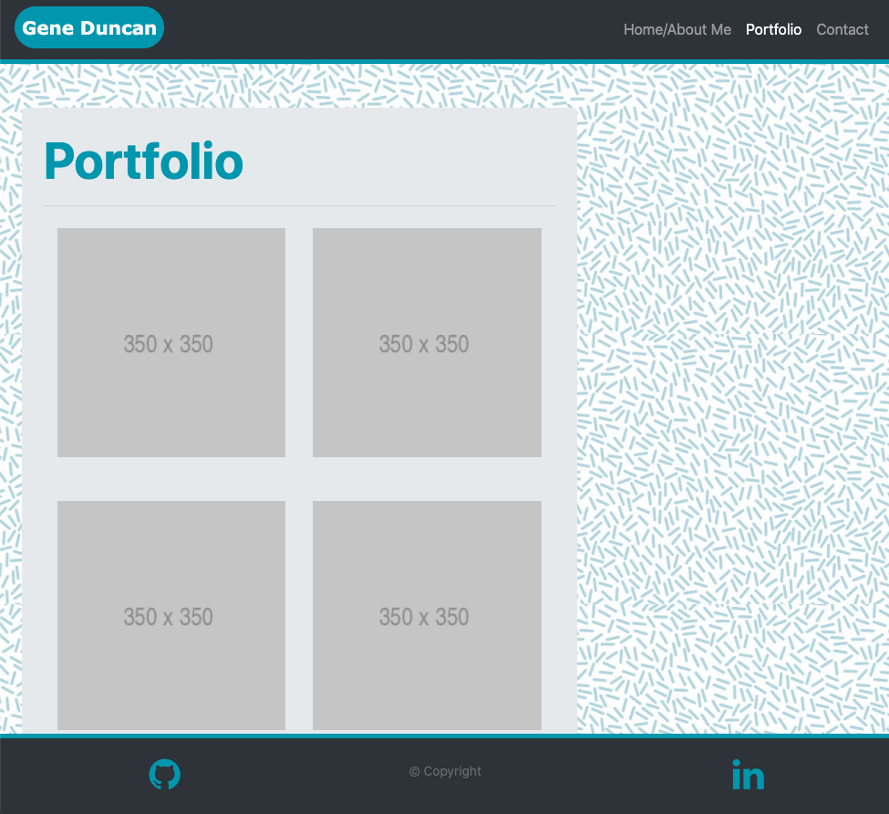
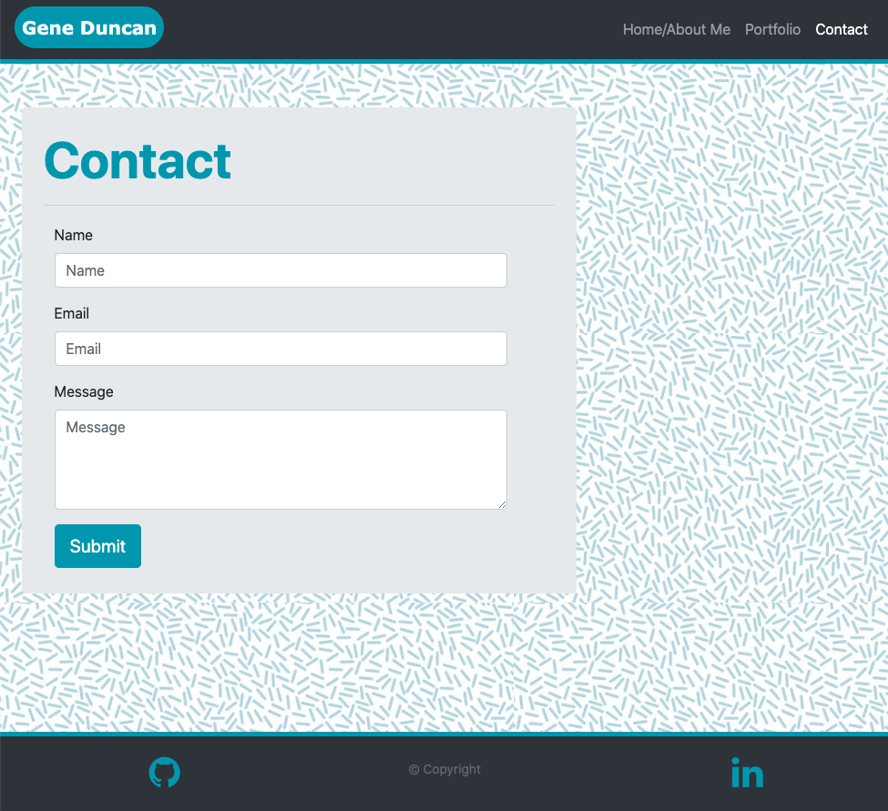

# 02 CSS Bootstrap: ResponsivePortfolio

This README has been generated to accompany the completed Responsive Portfolio. The purpose of the Responsive Portfolio is to create a personalized website using HTML, CSS, and Bootstrap templates. The goal is to maintain responsiveness throughout the website so the content can be properly viewed on any display size. All HTML code has been validated using [W3 Validator](https://validator.w3.org/).

## Link to Deployed Page

[Responsive Portfolio](https://duncangw1.github.io/ResponsivePortfolio/)

## Screenshots

Home/About Me page

---

Portfolio page

---

Contact page

---

## Contributors

- Gene Duncan (duncangw1)

## License & Copyright

© Gene Duncan
